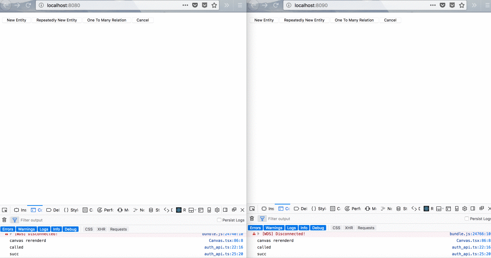
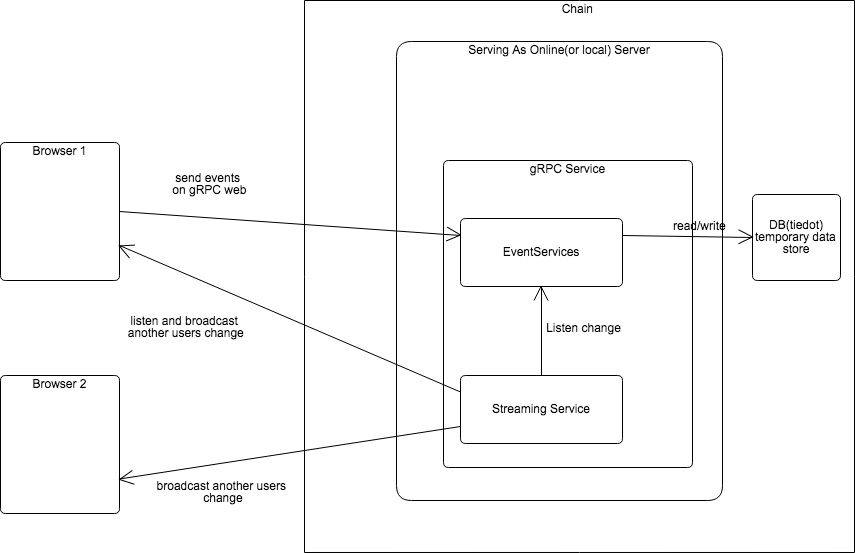

## ** State Of This repository is 0.0.1 Pre-alpha **

# chain

Entity-Relation Diagram Drawing Tool For Everyone

prototype image below




# How to Run

### install dependencies
```
make install-dev-deps
dep ensure
```

### run backend
```
cd cmd/chain
go run serve.go
```

### run frontend
```
cd _jsapp
yarn install
yarn start
```

## TODO
- [ ] run dev mode with docker-compose
- [ ] 1-binarize with go-bindata
- [ ] better-looking
- [ ] editing column
- [ ] save as file
- [ ] load from file
- [ ] move as command-line tool
- [ ] auto geneate DDL
- [ ] multi select entities
- [ ] grouping entities
- [ ] self association
- [ ] alpha release
- [ ] authentication, share another one
- [ ] use react-motion for fluent moving instead of konva event handler

# Contribution
PR's are welcome!

Let us invite you to chain slack team from invitation page.

https://chaininvite.herokuapp.com/

## About chain (server-mode)



